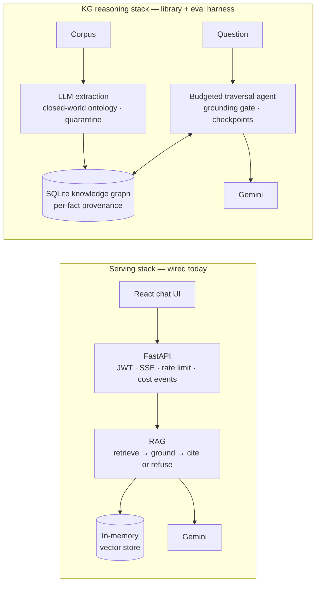

# AgentGraph — a budgeted knowledge-graph agent over enterprise documents

**Every answer carries an evidence path — or becomes a refusal.**

AgentGraph turns unstructured company documents — runbooks, incident reports, org charts,
dependency maps — into a typed knowledge graph and answers multi-step questions
(*"who owns the database behind this outage?"*) by traversing it under hard budgets.
Around the agent sits a complete serving stack (grounded document Q&A behind an API and
chat UI) and an instrumented performance-engineering harness with measured before/after
results.

**Designed and implemented by Jiezhong Wu** — the knowledge-graph agent, the retrieval
and serving stack, the FastAPI + React application, observability and tracing, the
evaluation and performance studies, and the CI/deployment pipeline.

181 Python tests · 29 frontend tests · FastAPI + React · RAG + knowledge graph · Docker + CI

## The knowledge-graph agent

- **Typed graph, closed world.** LLM extraction against a frozen ontology (7 entity
  types, 8 relation types): facts that don't fit the schema are quarantined, never
  invented. Every edge carries per-fact provenance back to the document that asserted it;
  content-hash ingest makes re-indexing an unchanged corpus free; transitive-shortcut
  hallucinations are mechanically reduced at the schema layer, where guarantees live.
- **Budgeted traversal.** Each question runs under hard caps on LLM calls, tool calls,
  hops, tokens, and dollars — checked *before* each call, not audited after. Budget
  breaches propagate to the caller; futile loops degrade into refusals.
- **Grounded by construction.** A positive answer with an empty evidence path is
  converted into a refusal — the graph version of "not in the docs." Ambiguity between
  valid candidates is an answer, not an error.
- **Resumable.** Sessions checkpoint to SQLite; a crashed run resumes without
  re-executing completed tool calls. The resume-deadlock bug class this invites was
  found, fixed, and documented.
- **Eval-hardened.** A golden multi-hop eval drove the agent from 2/7 to **6/7, stable
  across three frozen-code runs**; two adversarial review rounds confirmed 21 defects
  beyond the spec suite's reach — 16 fixed, the rest documented as deliberate tradeoffs.
  The full decision log, live-eval findings, and one deliberately open limitation:
  [DECISIONS.md](DECISIONS.md).

## The supporting system

- **Serving stack:** document Q&A that cites or refuses — chunking, embeddings, vector
  search, grounded prompting — behind a FastAPI service (JWT auth, SSE streaming,
  fail-open rate limiting, per-request cost events) with a React chat UI.
- **Performance engineering:** a deterministic instrumented harness (spans with self
  time, nearest-rank percentiles, bounded sample storage) used to diagnose four planted
  incident scenarios — latency, cost, retry storm, memory leak — and verify the fixes
  with numbers, then hold them with budgets enforced as a CI gate. Full case studies:
  [PART4_POSTMORTEMS.md](PART4_POSTMORTEMS.md).

## Results (measured, not estimated)

| Metric | Before | After |
|---|---|---|
| Ask p95 latency, serial | 0.273 s | **0.090 s** |
| Ask p95 latency, 8 concurrent users | 1.416 s | **0.133 s** |
| Provider calls per question | 11 | **4** |
| Input tokens per question | 7,553 | **2,529** |
| Cost per question | $0.000653 | **$0.000267** |
| Conversation cost at turn 10 | 10,991 tokens, rising | **3,277 tokens, flat** |
| Corpus indexing (49 chunks) | 49 calls / 0.746 s | **1 call / 0.025 s** |
| Knowledge-graph agent, golden multi-hop eval | 2/7 | **6/7, stable ×3 frozen runs** |
| Sample multi-hop answer | — | **~$0.0003 · 4 LLM calls** |
| Automated tests across the stack | — | **181 Python + 29 frontend, passing** |

> Measured with the deterministic instrumented harness over intentionally planted
> debugging scenarios. Raw run artifacts: [docs/measurements/](docs/measurements/);
> full methodology and provenance: [PART4_POSTMORTEMS.md](PART4_POSTMORTEMS.md) and
> [docs/PROVENANCE.md](docs/PROVENANCE.md).

## Architecture

Two stacks, honestly separated: the serving path that is wired today, and the
knowledge-graph reasoning path, which runs as a library and evaluation harness.



**Implemented and spec-tested, not wired into the serving path (by design, for now):**
Chroma persistence (`docsbot/store_persistent.py`) and hybrid BM25 + vector retrieval
with LLM reranking (`docsbot/retrieval.py`).

**Cross-cutting:** three session stores (SQLite agent checkpoints, Redis chat history,
TTL-capped service sessions) · retries, timeouts, and a circuit breaker · TTL answer
cache and content-hash embedding reuse · usage ledger and cost budgets · OpenTelemetry /
Phoenix tracing with a single redaction choke point · a CI performance gate.

## Try it

```bash
python -m venv .venv && source .venv/bin/activate
pip install -e ".[dev,persist,api,session]"
cp .env.example .env            # add a free Gemini key: https://aistudio.google.com/apikey

pytest                          # the whole stack, offline, ~30 s — no key needed

docsbot ask "Which task type should documents be embedded with?"   # RAG + citations
python evals/run_kg_evals.py                  # knowledge-graph agent, 7 multi-hop questions
python -m docsbot.perf.report --concurrency 8 # latency / cost / call-count report
```

## Run the interactive app

```bash
uvicorn docsbot.api.app:create_app --factory   # backend on :8000
```

In a second terminal:

```bash
cd frontend
npm install
npm run dev                                    # chat UI on :5173
```

Open **http://localhost:5173** and log in with the development credentials —
`admin` / `changeme` (override with `DOCSBOT_USER` / `DOCSBOT_PASSWORD` in `.env`;
answers need the free Gemini key from the setup step). Redis is optional: without it,
rate limiting fails open and sessions degrade gracefully rather than taking the app
down. `docker compose up` brings up backend, frontend, and Redis together.

What you can do in the UI:

- authenticated chat with **token-by-token streaming**
- **multi-turn sessions** that remember the conversation
- Markdown-rendered answers with **clickable citation snippets**
- **per-message cost** display
- **stop generation** mid-stream
- automatic logout on expired auth, and self-healing connection banners

## Layout

The Python package keeps its original name, `docsbot`.

```
docsbot/
  kg/                                            knowledge graph: schema, extraction, store, ingest
  agent/                                         traversal agent: tools, runner, budgets, sessions
  tracing/                                       OpenTelemetry / Phoenix instrumentation
  ingest.py  store.py  retrieval.py  rag.py      retrieval pipeline (chunking, hybrid search, RAG)
  api/                                           FastAPI service: auth, streaming, sessions
  service/  perf/                                instrumented pipeline + measurement harness
frontend/                                        React + TypeScript chat UI
evals/                                           golden sets, LLM-as-judge, KG agent evals
tests/                                           181 specs across all layers
docs/measurements/                               raw before/after performance runs
docs/design/                                     design notes for each layer
docs/PROVENANCE.md                               component-level provenance record
```

## Acknowledgments

Developed by Jiezhong Wu, with guidance from an experienced mentor and AI-assisted
development. The repository also incorporates provided specifications, evaluation
corpora, incident scenarios, and selected reference components, used with permission;
those materials remain the property of their original author and are not licensed for
reuse. Component-level provenance: [docs/PROVENANCE.md](docs/PROVENANCE.md).
